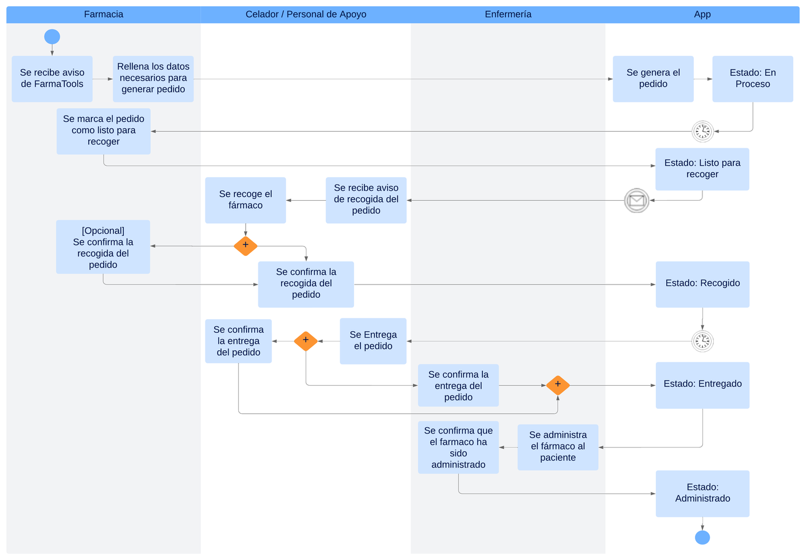
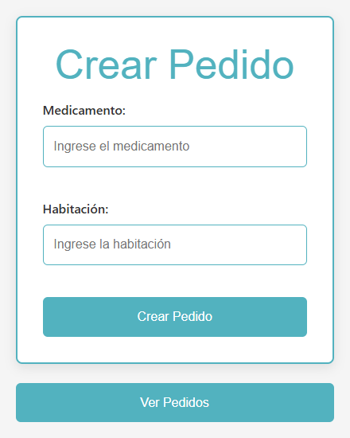
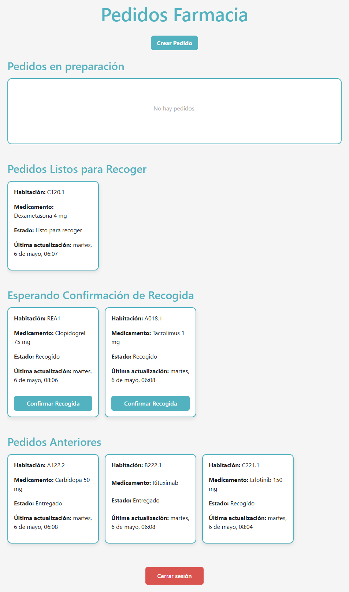
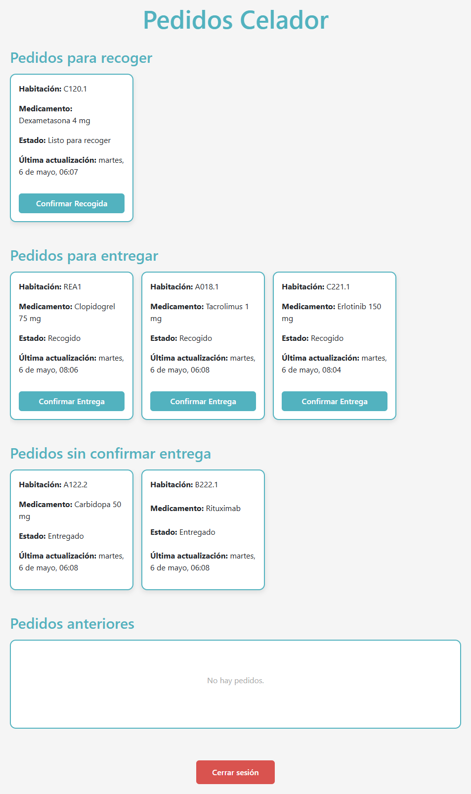
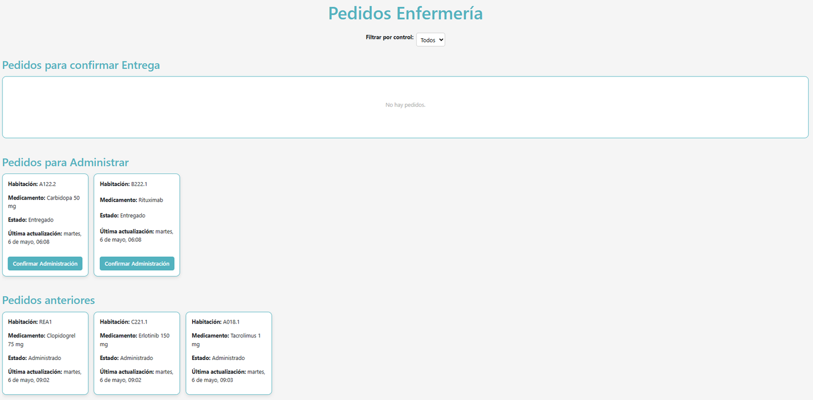
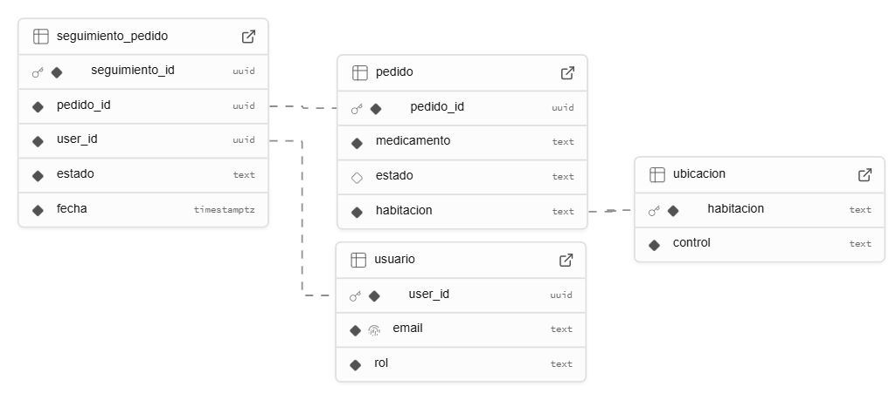

<p align="center">
  
</p>

<h1 align="center">FarmaTrace</h1>

<p align="center">
  <strong>Aplicación web para el seguimiento de fármacos en el entorno intrahospitalario</strong><br>
  Trazabilidad del traslado de medicamentos entre Farmacia, Celadores y Enfermería
</p>

<p align="center">
  Proyecto del Grado en Ingeniería Biomédica · Universidad Rey Juan Carlos<br>
  Desarrollado en colaboración con el <strong>Hospital Universitario Fundación Alcorcón</strong>
</p>

<p align="center">
  
  
  
  
  
</p>

<p align="center">
  📄 <a href="docs/FarmaTrace-articulo.pdf">Artículo</a> &nbsp;·&nbsp; 🖼️ <a href="docs/FarmaTrace-poster.pdf">Póster</a>
</p>

---

## Resumen

En el hospital, una demora o una pérdida en la entrega de un medicamento puede afectar directamente al paciente. Sin embargo, cuando un fármaco sale del servicio de Farmacia, a menudo no queda registro de **dónde está, en qué estado se encuentra ni quién lo lleva**, y los celadores pierden tiempo buscando tareas pendientes.

**FarmaTrace** digitaliza ese circuito:

- Farmacia crea el pedido.
- El celador recibe el aviso cuando está listo, lo recoge y lo entrega.
- Enfermería confirma la recepción y la administración.

Cada paso queda registrado con **usuario, fecha y hora, y ubicación**, validado digitalmente por los servicios implicados.

**Objetivo:** mejorar la dinámica intrahospitalaria, orientándola hacia la eficiencia, la seguridad y la responsabilidad en los traslados entre servicios clínicos.

## Flujo de un pedido

| Estado | Quién lo marca | Qué significa |
|---|---|---|
| 🟡 **En proceso** | Farmacia | Pedido creado (tras el aviso de FarmaTools) y en preparación |
| 🔵 **Listo para recoger** | Farmacia | Medicamento preparado; se avisa al celador |
| 🟣 **Recogido** | Celador *(Farmacia puede validarlo)* | El celador ha recogido el fármaco |
| 🟢 **Entregado** | Celador y/o Enfermería | El medicamento ha llegado al control de enfermería |
| ✅ **Administrado** | Enfermería | El fármaco se ha administrado al paciente |

<p align="center">
  
</p>

### Trazabilidad frente a velocidad

Los estados *Recogido* y *Entregado* los pueden confirmar dos roles distintos. Exigir siempre la doble verificación ralentizaría el servicio, sobre todo en Farmacia, que tiene mucha carga de trabajo. Por eso, de acuerdo con el Servicio de Farmacia del hospital:

- El pedido **avanza en cuanto lo confirma uno de los roles**.
- **El otro rol puede verificarlo después.**
- La aplicación distingue qué pedidos tienen la verificación completa y cuáles solo parcial.

## Capturas

| Crear pedido (Farmacia) | Pedidos de Farmacia | Pedidos del Celador |
|:---:|:---:|:---:|
|  |  |  |

<p align="center"><strong>Pedidos de Enfermería</strong> (con filtro por control de enfermería)</p>
<p align="center">
  
</p>

## Roles y páginas

| Página | Ruta | Acceso |
|---|---|---|
| Inicio de sesión | `/` | Todos (correo + contraseña facilitada por el Servicio Técnico) |
| Cambio de contraseña | `/cambiar-contraseña` | Todos |
| Crear pedido | `/crear-pedido` | Solo **Farmacia**; valida que la habitación exista |
| Pedidos de Farmacia | `/pedidos-farmacia` | **Farmacia**: en preparación, listos, pendientes de confirmar recogida y anteriores |
| Pedidos del Celador | `/pedidos-celador` | **Celador**: para recoger, para entregar, sin confirmar entrega y anteriores |
| Pedidos de Enfermería | `/pedidos-enfermeria` | **Enfermería**: filtro por control, confirmar entrega y administración |
| Sin acceso | `/sin-acceso` | Usuarios sin un rol válido asignado |

No hay registro público: **solo los usuarios creados o invitados por el Servicio Técnico** desde Supabase pueden entrar. Cada usuario nuevo se crea con el rol `no_rol` y el Servicio Técnico le asigna después `farmacia`, `celador` o `enfermeria`.

## Arquitectura

- **Frontend:** React 19 + Vite 6, React Router 7, Bootstrap 5
- **Backend:** Supabase (PostgreSQL, autenticación, funciones y *triggers*)
- **Hosting:** Vercel

> En una primera versión se probó Firebase, pero la lógica necesaria superaba las limitaciones del plan gratuito, así que se migró a Supabase (código abierto).

### Modelo de datos

<p align="center">
  
</p>

| Tabla | Columnas | Descripción |
|---|---|---|
| `usuario` | `user_id` (UUID, PK), `email`, `rol` | Rol de cada usuario. Se rellena automáticamente con un *trigger* sobre `auth.users` |
| `ubicacion` | `habitacion`, `control` | Habitaciones del hospital y el control de enfermería al que pertenecen |
| `pedido` | `pedido_id` (UUID, PK), `medicamento`, `estado`, `habitacion` | Pedido y su estado actual |
| `seguimiento_pedido` | `seguimiento_id` (UUID, PK), `pedido_id`, `user_id`, `estado`, `fecha` | Historial de cada cambio de estado: quién, qué y cuándo |

Al crear un pedido, un *trigger* genera automáticamente su primera entrada en `seguimiento_pedido` con el estado *En proceso*.

## Instalación local

**Requisitos:** Node.js 18 o superior y un proyecto de Supabase con las tablas anteriores.

```bash
git clone https://github.com/M-Guerrero/FarmaTrace.git
cd FarmaTrace
npm install
```

Crea un archivo `.env` en la raíz (**no lo subas al repositorio**):

```env
VITE_SUPABASE_URL=https://<tu-proyecto>.supabase.co
VITE_SUPABASE_KEY=<tu-anon-key>
```

```bash
npm run dev       # servidor local en http://localhost:5173
npm run build     # build de producción en /dist
npm run preview   # previsualizar el build
```

## Estructura del proyecto

```
├── docs/                    # Artículo, póster e imágenes del README
└── src/
    ├── App.jsx              # Rutas
    ├── supabaseClient.js    # Cliente de Supabase
    ├── components/
    │   └── CarruselPedidos.jsx
    └── pages/
        ├── Login.jsx
        ├── CambioContraseña.jsx
        ├── CrearPedido.jsx
        ├── PedidosFarmacia.jsx
        ├── PedidosCelador.jsx
        ├── PedidosEnfermeria.jsx
        └── SinAcceso.jsx
```

## Limitaciones y trabajo futuro

- **Sin integración con los sistemas del SERMAS:** Farmacia tiene que pasar a mano los datos de FarmaTools a FarmaTrace. La ventaja es que la app no depende de los sistemas internos y puede desplegarse en cualquier servidor.
- **Catálogo de medicamentos:** integrar una base de datos de fármacos para no tener que escribirlos a mano.
- **Notificaciones en tiempo real** (Supabase Realtime / push) en cada cambio de estado.
- **Métricas** de tiempos de preparación, recogida y entrega.

## Autores

- **Blanca Andreo León**
- **Manuel Guerrero Sancho** · [@M-Guerrero](https://github.com/M-Guerrero)
- **Laura Lagartera Labrador**

Grado en Ingeniería Biomédica, Universidad Rey Juan Carlos.

## Agradecimientos

A **Estefanía Zhan Zhou**, del Servicio de Farmacia del Hospital Universitario Fundación Alcorcón, por acompañarnos y orientarnos durante todo el proyecto.
